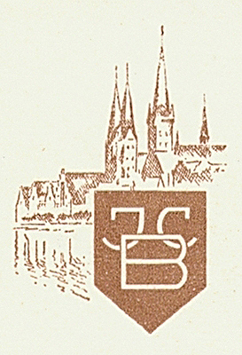

Der "Kunstverlag J.C. Blumenberg" war der Verlag für Grafiken von Ric und Fritz Neumann. Es sind zwei Prägestempel bekannt.





Nach dem, was wir derzeit wissen, ist es fast sicher, dass die erste die ältere ist. Zwei Hauptargumente sprechen dafür:
* Es gibt viel mehr Drucke, die die zweite Marke zeigen.
* Aus der Geschichte des Verlags ist bekannt, dass er mehrmals den Standort gewechselt hat, insbesondere nach dem Zweiten Weltkrieg. Zunächst mit Sitz in Lübeck, Deutschland. Das Logo/Stempelzeichen zeigte zu dieser Zeit sicherlich ein berühmtes [Wahrzeichen dieser Stadt] (https://ric-unknownartist.projektemacher.org/post/second-jcb-stamp/).

Im Zuge der Suche nach Ric waren diese Zeichen der erste Hinweis auf die Verbindung zwischen Ric und Fritz Neumann. Da eine dieser Marken auch das Holstentor in Lübeck zeigt, wurde eine Verbindung nach Lübeck vermutet.

Die frühe Geschichte dieses Verlages ist weitaus leichter zu erforschen als die spätere. Dafür kann es mehrere Gründe geben. Entweder hat es mit urheberrechtlichen Gründen zu tun - vielleicht ist das entsprechende Material einfach nicht öffentlich zugänglich - oder der Verlag war bereits im Niedergang begriffen und verschwand einfach langsam.

Eine Spur, die der Verlag in Lübeck hinterlassen hat, findet sich im [Adressbuch von 1933] (https://digital-stadtbibliothek.luebeck.de/viewer/fullscreen/L130311933/990/). Eine weitere Spur findet sich in den Archiven des Börsenvereins der Deutschen Buchhändler, die heute Teil des Landesarchivs Sachsen sind. Demnach war der Verlag [von 1930 bis 1946 als Mitglied aufgeführt] (https://archiv.sachsen.de/archiv/bestand.jsp?guid=1b16d60a-e455-44df-9ed7-a7fbfbb1bb54). Ob dies jedoch bedeutet, dass die Mitgliedschaft bereits 1930 begann, ist fraglich, da der Verlag selbst bereits im [Börsenblatt von 1924](https://digital.slub-dresden.de/data/kitodo/Brsfded_1666418854-1924112501_01-f/Brsfded_1666418854-1924112501_01-f_tif/jpegs/Brsfded_1666418854-1924112501_01-f.pdf), [1929](https://www.boersenblatt-digital.de/pageview?tx_dlf[id]=2576&tx_dlf[page]=54) und [1930](https://www.boersenblatt-digital.de/pageview?tx_dlf[id]=2796&tx_dlf[page]=6) erwähnt wird.
Neben der Veröffentlichung von Anzeigen im Börsenblatt gab der Verlag auch Kataloge und anderes Werbematerial heraus; es gibt mindestens zwei Hinweise darauf:
* In der Bibliothek der Nordwest-Universität [Verlagsprospekte aus den Jahren 1920 bis 1940] (https://findingaids.library.northwestern.edu/repositories/7/archival_objects/507010)
* Im Quellenabschnitt des deutschen Wikipedia-Artikels über [Erns Zipperer](https://de.wikipedia.org/wiki/Ernst_Zipperer) wird einer erwähnt, der 1963 veröffendlicht wurde

Der letztere könnte einige Werke von Ric enthalten.

Es gibt weitere Beispiele für das Verlagsprogramm, wie dieses hier:



Da [Hans Blumenberg](https://en.wikipedia.org/wiki/Hans_Blumenberg), Sohn des Verlagsgründers, als Philosoph bekannt wurde, ist sein schriftlicher Nachlass erhalten geblieben und wird vom Deutschen Literaturarchiv Marbach verwahrt. Zwei Briefe zwischen ihm und dem Verlag sind für [1944 und 1946] katalogisiert (https://kalliope-verbund.info/de/findingaid_index?fa.id=DE-2498-BF00016610&lastparam=true.). Wenn man tiefer gräbt, kann man auch Briefe zwischen ihm und Walter Tetzlaff vom Verlag finden.

Aus Biographien ([1](https://www.herder.de/hk/hefte/archiv/2020/7-2020/blumenbergs-engel-zum-100-geburtstag-des-philosophen-hans-blumenberg/) und [2](https://ikaz-communio.de/ojs/index.php/ikaz/article/view/6115/6037)) von ihm kann man auch einige weitere Informationen über den Verlag seines Vaters erhalten:

Josef Carl Blumenberg wurde in Hildesheim geboren und in St. Godehard getauft. Er besuchte vom 1. April 1891 bis zum 2. April 1894 das Hildesheimer Josephinum und benötigte drei Kalenderjahre für zwei Schuljahre. Er musste die sechste Klasse wiederholen mit dem Vermerk: "Der Schüler zeigt so wenig Begabung und Lernwillen, dass den Eltern geraten wird, ihn von der Schule zu nehmen." Joseph Blumenberg absolvierte eine Buchhändlerlehre im Verlagshaus von Georg Olms in Hildesheim und sammelte in Brügge Erfahrungen im internationalen Kunsthandel. 1914 meldete er sich als so genannter deutscher Auswanderer freiwillig an die Front.  Für seinen Militärdienst wurde er mit dem Eisernen Kreuz und dem Ehrenkreuz für Frontkämpfer ausgezeichnet.  Nach dem Ersten Weltkrieg gründete er in Lübeck, das damals zum Bistum Osnabrück gehörte, den "Kunstverlag J.C. Blumenberg - Import Export" und heiratete am 6. September 1919 in der St. Hedwigs-Kathedrale in Berlin. Seine Frau brachte das Lübecker Grundstück Hansestraße 6 in die Ehe ein. Es ging am 3. März 1938 durch Schenkungsurkunde in den Besitz ihres Mannes über und wurde 1948 verkauft.
Else Blumenberg (1882-1945) wurde als Schreier aus Rosenberg in Oberschlesien geboren. Sie wurde die Mutter von zwei Söhnen. Bei ihrer Hochzeit konvertierte sie vom Judentum zum Katholizismus. Else Blumenberg hatte fünf Schwestern, die nicht konvertierten. Drei von ihnen wurden ermordet.
Nach dem [Bombenangriff auf Lübeck (28. März 1942)](https://en.wikipedia.org/wiki/Bombing_of_L%C3%BCbeck_in_World_War_II) erwirbt er ein großes Grundstück mit Wohnhaus und Garage in Bargteheide, an der Bahnlinie nach Hamburg gelegen, "Am Bahnhof 1".
Die Situation der Familie verschlechtert sich dramatisch, als Else Blumenberg am 13. April 1942 einen Strafbefehl erhält, weil sie den zweiten vorgeschriebenen Vornamen "Sara" nicht in ihre Papiere eintragen lässt. Sie wurde für vierzehn Tage in das Frauengefängnis Lauerhof in Lübeck eingewiesen. Am 1. Februar 1945 wurde Else Blumenberg zu einer ärztlichen Untersuchung zur Feststellung ihrer Arbeitsfähigkeit eingewiesen; sie starb am 10. November 1945 (nach Kriegsende) in der neurologischen Abteilung des Krankenhauses Eppendorf.

Die Blumenbergs waren praktizierende Katholiken, obwohl Lübeck eine protestantische Stadt ist. Das Verlagsprogramm bestand aus religiöser Gebrauchskunst wie Schutzengelbildern für Kirchen, Klöster und Krankenhäuser, Andachtsbildern für Taufen und Konfirmationen, Hochzeiten und Beerdigungen sowie Reproduktionen von Gemälden.

Mark Strong von [Meibohm Fine Arts](https://www.meibohmfinearts.com/) hat [großartige Nachforschungen](https://www.meibohmfinearts.com/artists/details/2874) über diesen Verlag angestellt.

Er hat auch mehrere Dokumente aus dem Firmenarchiv veröffentlicht, die einen Einblick in die verschiedenen Standorte des Verlags geben:





Sowie zwei alte Logos des Verlages:

{style="display: inline-block;"}

{style="display: inline-block;"}

