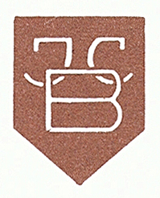
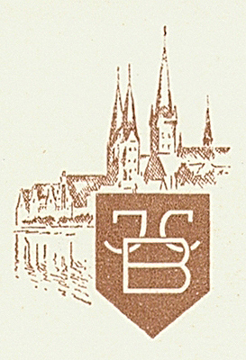

The "Kunstverlag (fine art publisher) J.C. Blumenberg" was the publishing house for prints by Ric and Fritz Neumann. There are two embossing marks known.





From what we currently know, it's almost certain, that the first one is the older one. Two main arguments are in favour of this:
* There are far more print showing the second mark.
* From the history of the publisher it is know to have changed location several times, especially after the second world war. Initially located in Lübeck, Germany. The logo / stamp mark around that time certainly showed a famous [landmark from this city](https://ric-unknownartist.projektemacher.org/post/second-jcb-stamp/).

During the course of the search for Ric these marks were the first hint on the connection between Ric and Fritz Neumann. Since one of these also show the Holsten Gate in Lübeck, a connection towards Lübeck was suspected.

The early history of this publisher house is far easier to research then the later one. There might be several reasons for this. Either it's related to copyright reasons - maybe the relevant material just isn't publicly available or the publishing company was already in decline and just faded slowly away.

One trace the publishing house has left in Lübeck, can be found in the [address book of 1933](https://digital-stadtbibliothek.luebeck.de/viewer/fullscreen/L130311933/990/). Another trace ca ben found in the archives of the Börsenverein der Deutschen Buchhändler, which is now part of the Landesarchiv Sachsen. Accordingly, the publishing house was [listed as a member from 1930 to 1946](https://archiv.sachsen.de/archiv/bestand.jsp?guid=1b16d60a-e455-44df-9ed7-a7fbfbb1bb54). But whether this means that membership began as early as 1930 is open to question, as the publisher itself is already mentioned in the [publication (Börsenblatt) of 1924](https://digital.slub-dresden.de/data/kitodo/Brsfded_1666418854-1924112501_01-f/Brsfded_1666418854-1924112501_01-f_tif/jpegs/Brsfded_1666418854-1924112501_01-f.pdf), [1929](https://www.boersenblatt-digital.de/pageview?tx_dlf[id]=2576&tx_dlf[page]=54) and [1930](https://www.boersenblatt-digital.de/pageview?tx_dlf[id]=2796&tx_dlf[page]=6).
Apart from publishing advertisements in the Börsenblatt, the publishing house also issued catalogues and other promotional material, there are at least two references to them:
* In the library of the Nortwestern University [publishing prospectuses issued between 1920 and 1940](https://findingaids.library.northwestern.edu/repositories/7/archival_objects/507010)
* In the sources section of the German Wikipedia article on [Erns Zipperer](https://de.wikipedia.org/wiki/Ernst_Zipperer) one is mentioned released in 1963.

The later one might contain some works of Ric.

There are other examples for the publishing programme, like this one:



Since [Hans Blumenberg](https://en.wikipedia.org/wiki/Hans_Blumenberg), son of the founder of the publishing house, became famous as a philosopher his written legacy has been preserved and is held by Deutsches Literaturarchiv Marbach. Two letters between him and the publishing house are catalogued for [1944 and 1946](https://kalliope-verbund.info/de/findingaid_index?fa.id=DE-2498-BF00016610&lastparam=true.). When digging deeper one can also find letters between him and Walter Tetzlaff of the publishing house.

From biographies ([1](https://www.herder.de/hk/hefte/archiv/2020/7-2020/blumenbergs-engel-zum-100-geburtstag-des-philosophen-hans-blumenberg/) and [2](https://ikaz-communio.de/ojs/index.php/ikaz/article/view/6115/6037)) of him one can also get some more information on the publishing house his father:

Josef Carl Blumenberg was born in Hildesheim and baptised in St. Godehard. He attended the Hildesheim Josephinum from 1 April 1891 to 2 April 1894, taking three calendar years for two school years. He had to repeat the sixth class with the note: "The pupil shows so little aptitude and desire to study that the parents are advised to withdraw him from the school." Joseph Blumenberg completed an apprenticeship as a bookseller at Georg Olms' publishing house in Hildesheim and gained experience in the international art trade in Bruges. In 1914, he volunteered for the front as a so-called German expatriate.  His military service was honoured with the Iron Cross and the Cross of Honour for Frontline Combatants.  After the First World War, he founded the "Kunstverlag J.C. Blumenberg - Import Export" in Lübeck, which at the time belonged to the diocese of Osnabrück, and married on 6 September 1919 in St. Hedwig's Cathedral in Berlin. His wife brought the Lübeck property at Hansestraße 6 into the marriage. It became the property of her husband on 3 March 1938 via a deed of gift and was sold in 1948.
Else Blumenberg (1882-1945) was born Schreier from Rosenberg in Upper Silesia. She became the mother of two sons. She converted from Judaism to Catholicism at her wedding. Else Blumenberg had five sisters who did not convert. Three of them were murdered.
After the [bomb attack on Lübeck (28 March 1942)](https://en.wikipedia.org/wiki/Bombing_of_L%C3%BCbeck_in_World_War_II), he acquires a large property with a residential building and garage in Bargteheide, located on the railway line to Hamburg, "Am Bahnhof 1".
The family's situation worsened dramatically when, on 13 April 1942, Else Blumenberg was given a penalty order for not having the second prescribed first name "Sara" entered on her documents. She was sent to the Lauerhof women's prison in Lübeck for a fortnight. On 1 February 1945, Else Blumenberg was ordered to undergo a medical examination to determine her ability to work; she died on 10 November 1945 (after the end of the war) in the neurological ward of Eppendorf Hospital.

The Blumenbergs were practising Catholics, although Lübeck is a Protestant city. The publishing programme consisted of religious utility art such as guardian angel pictures for churches, monasteries and hospitals, devotional pictures for baptisms and confirmations, weddings and funerals and reproductions of paintings.

Mark Strong from [Meibohm Fine Arts](https://www.meibohmfinearts.com/) has done [great research](https://www.meibohmfinearts.com/artists/details/2874) on this publisher.

He also publish several document from the company archive, which give an insight to the different locations of the publisher:





As well as two old logos of the publisher:

{style="display: inline-block;"}

{style="display: inline-block;"}

